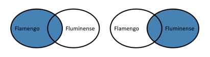
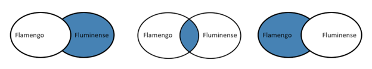
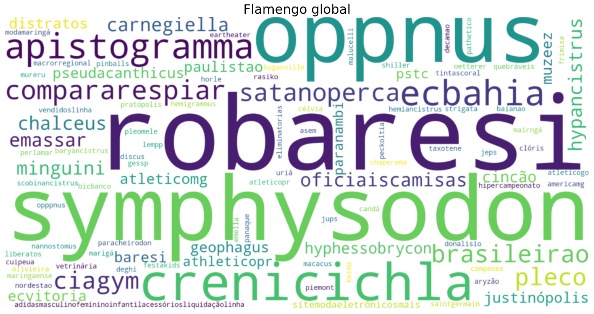
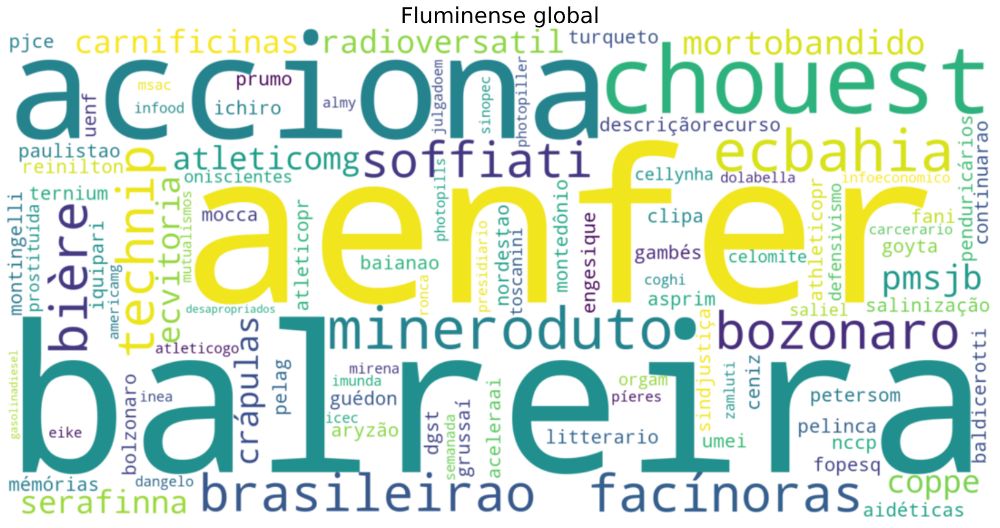
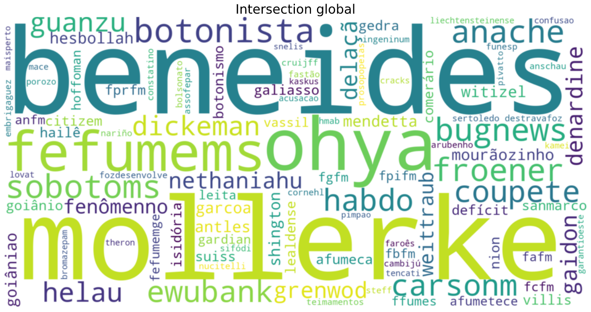
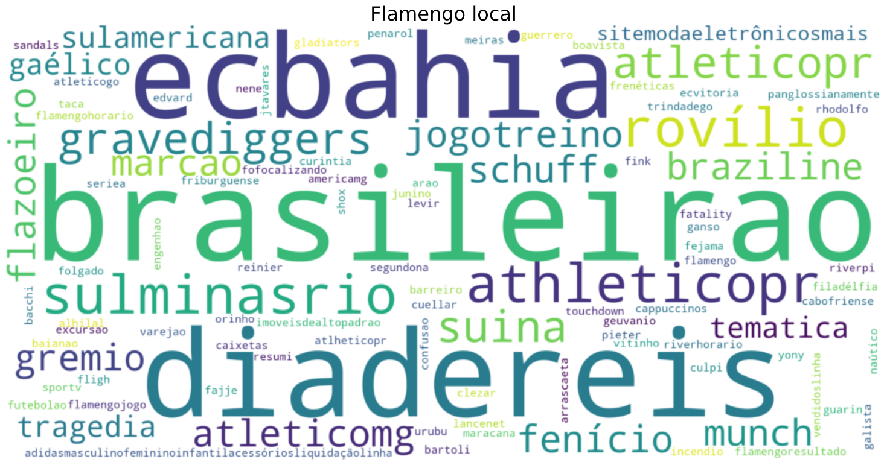
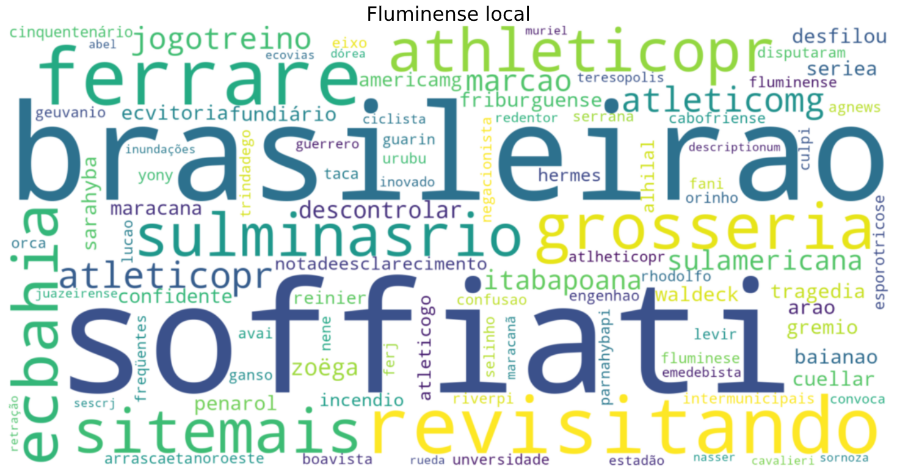
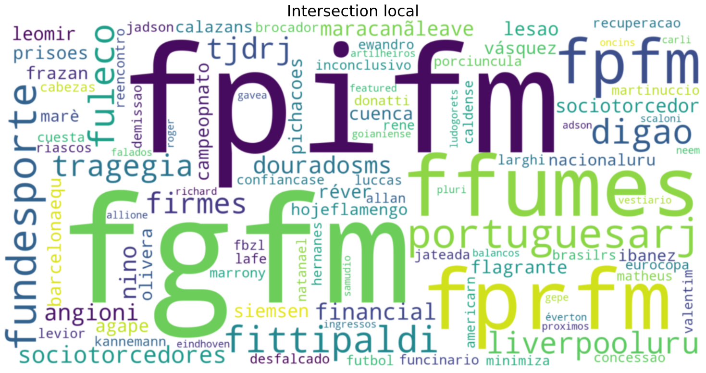

# Crunching Brazil's Web Data with Spark

The main focus of this project was to use Spark and process Brazil's Web Data. This allowed us to analyze which are the most relevant words related to two of the largest soccer teams from Rio de Janeiro. The names of the soccer teams involved in the analisys are **Flamengo** and **Fluminense**.

The data used was available in a S3 bucket and was extracted from <a href="https://commoncrawl.org/">Common Crawl</a>. Our first step was to go through Brazil's Web vocabulary and remove words that are either too common or way too rare, as these words might be too specific or may represent typos, for example. To do so, we defined both an upper limit and a lower limit for frequency. If a specific word appears in more than 80% of Brazil's webpages or if that word appears in less than 5 of those webpages, the word is ignored going forward.

With a smaller dataset it was time to start doing the math needed to discover the most relevant words to each of the teams and, also, the most relevant related to both of them together. We started by calculating the Inverse Document Frequency (IDF) of each word with the following equation:

    

where *docs(word)* is the number of documents in which a specific word appears and *N* represents the number of documents in the dataset. Next, it was necessary to the normalized frequency of each word that appears in documents containing at least one of the target words (Flamengo, Fluminense) through the following equation:

    

where *count(word)* is the absolute number of times a word appears in the documents being analyzed. Although we were making progress, the results that we were obtaining referred to the following cases:

    

The objective was actually to verify which words are more relevant when the target words appear separately and when they appear together. Therefore it was necessary to go even further and do the math for these cases:

    

To make it possible we used both *intersection* and *subtractByKey* methods from <a hraf="https://spark.apache.org/docs/latest/api/python/index.html">pyspark</a>. With the results obtained in this last step, we were able to calculate the relevance of each word in each of the desired cases by multiplying a words normalized frequency by its IDF. In the first iteration of this analisys, the whole vocabulary from documents containing any of the target words was used. Therefore, it was possible to find out which are the most relevant words in each of the following scenarios:

- Documents containing "Flamengo", but not "Fluminense"
- Documents containing "Fluminense", but not "Flamengo"
- Documents containing both "Flamengo" and "Fluminense"

The following word clouds represent the top 100 most relevant words in each of the desired cases:

    

________________

    

________________

    

The words that are most emphasized by the word clouds are mostly nonsense, but there was actually margin for some strange results. "Flamengo" is not only a soccer team, but also a neighbourhood in Rio de Janeiro. Likewise, "Fluminense" means more than a soccer team. It describes anything that comes from Rio de Janeiro.

Nonetheless, something had to be done in order to get better results. Thus, we resorted to a more complex analisys for our second iteration. We decided to consider only the local vocabulary, which means we ignored any word that was not in the range of 5 words before or after the occurance of a target word. This new approach yielded much better results:

    

________________

    

________________

    

