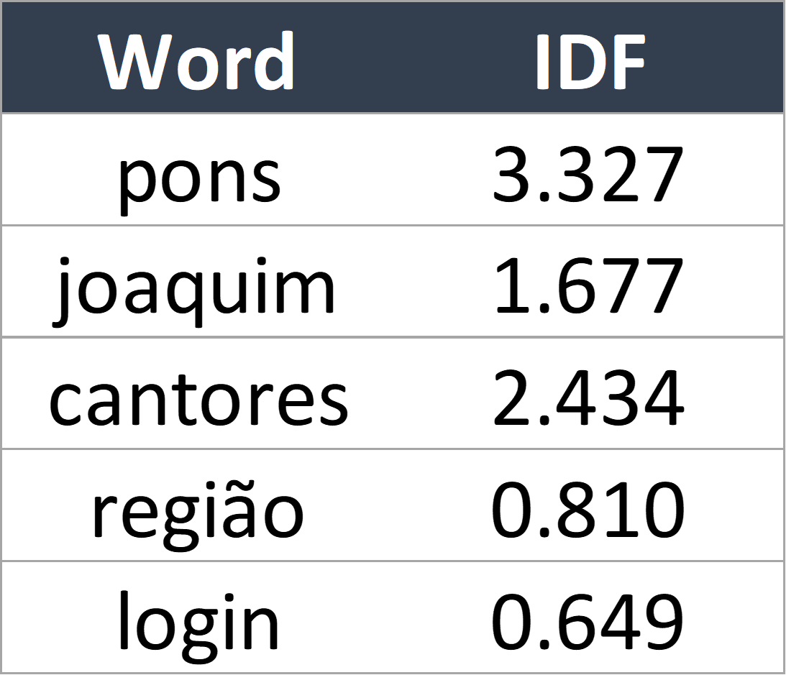

# Crunching Brazil's Web Data with Spark

The main focus of this project was to use Spark and process Brazil's Web Data. This allowed us to analyze which are the most relevant words related to two of the largest soccer teams from Rio de Janeiro. The names of the soccer teams involved in the analisys are **Flamengo** and **Fluminense**.

The data used was available in a S3 bucket and was extracted from <a href="https://commoncrawl.org/">Common Crawl</a>. Our first step was to go through Brazil's Web vocabulary and remove words that are either too common or way too rare, as these words might be too specific or may represent typos, for example. To do so, we defined both an upper limit and a lower limit for frequency. If a specific word appears in more than 80% of Brazil's webpages or if that word appears in less than 5 of those webpages, the word is ignored going forward.

With a smaller dataset it was time to start doing the math needed to discover the most relevant words to each of the teams and, also, the most relevant related to both of them together. We started by calculating the Inverse Document Frequency (IDF) with the following equation:

    

where *docs(word)* is the number of documents in which a specific word appears and *N* represents the number of documents in the dataset. Through this approach, over a small sample of documents, we were able to obtain the following sample of results:

    

